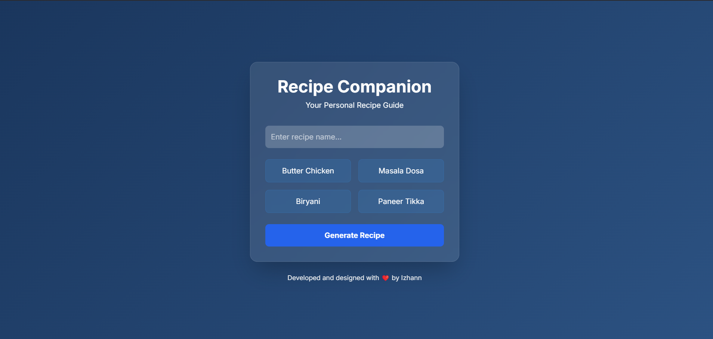
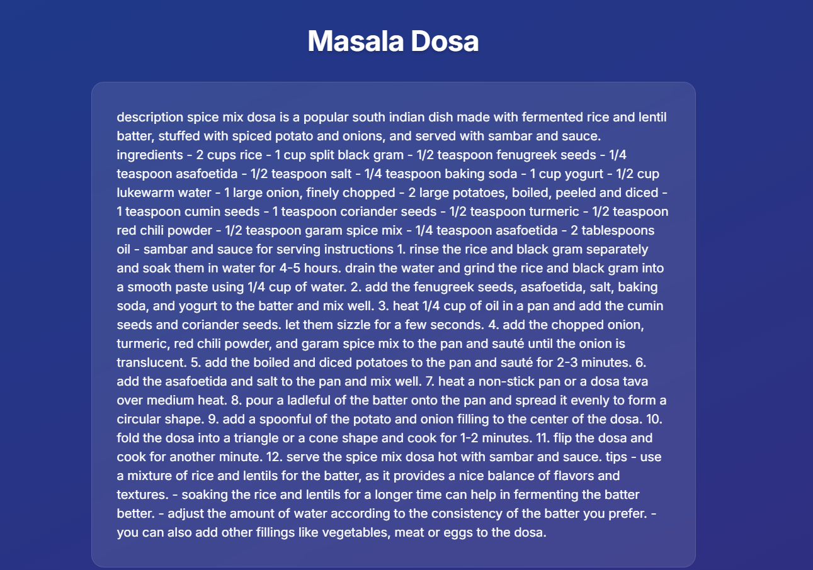

# Recipe Companion

A modern web application that generates detailed recipes in Hinglish (Hindi + English) using AI. The app provides step-by-step cooking instructions, ingredients lists, and traditional cooking tips.

## Screenshots

### Main Interface


### Recipe Generation


## Features

- 🤖 AI-powered recipe generation
- 🇮🇳 Hinglish language support
- 📝 Detailed step-by-step instructions
- 🧂 Complete ingredients list
- 💡 Traditional cooking tips
- 🎨 Modern glass-morphism UI
- 📱 Responsive design

## Tech Stack

- Frontend: HTML5, TailwindCSS
- Backend: Node.js, Express
- AI: Groq API (llama3-8b-8192 model)
- Real-time: Socket.IO

## Setup

1. Clone the repository:
```bash
git clone https://github.com/Muhammad-izhaan/recipe_companion.git
```

2. Install dependencies:
```bash
npm install
```

3. Create a `.env` file with your Groq API key:
```
GROQ_API_KEY=your_api_key_here
PORT=3000
```

4. Start the server:
```bash
node server.js
```

5. Open `http://localhost:3000` in your browser

## Credits

Developed and designed with ❤️ by Izhann
